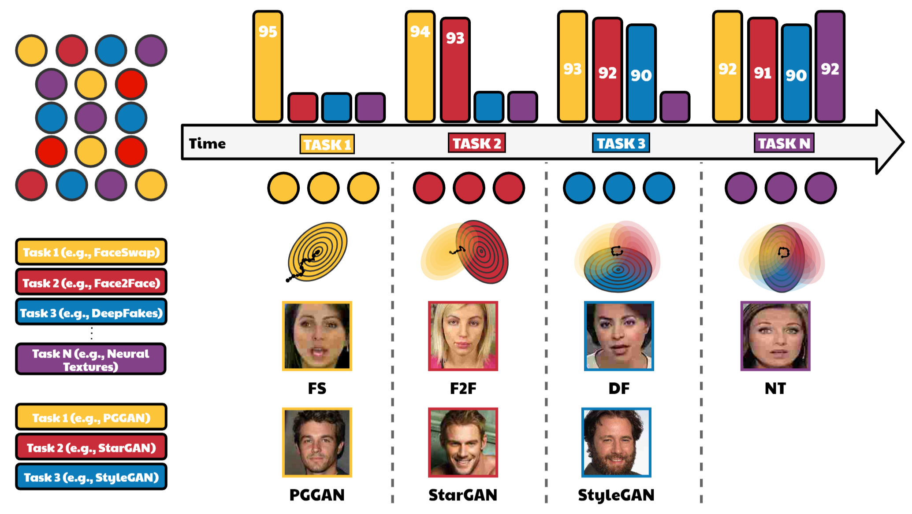

# 

# CoReD - Overview
__Title:__ *CoReD: Generalizing Fake Media Detection with Continual Representation using Distillation* 

**([Accepted for oral presentation at ACMMM '21](https://2021.acmmm.org/)) ([arXiv](https://arxiv.org/abs/2107.02408))**



## Citation

If you find our work useful for your research, please consider citing the following papers :)

```
@misc{kim2021cored,
    title={CoReD: Generalizing Fake Media Detection with Continual Representation using Distillation},
    author={Minha Kim and Shahroz Tariq and Simon S. Woo},
    year={2021},
    eprint={2107.02408},
    archivePrefix={arXiv},
    primaryClass={cs.CV}
}
```

# Pretrained weights
Coming soon!
