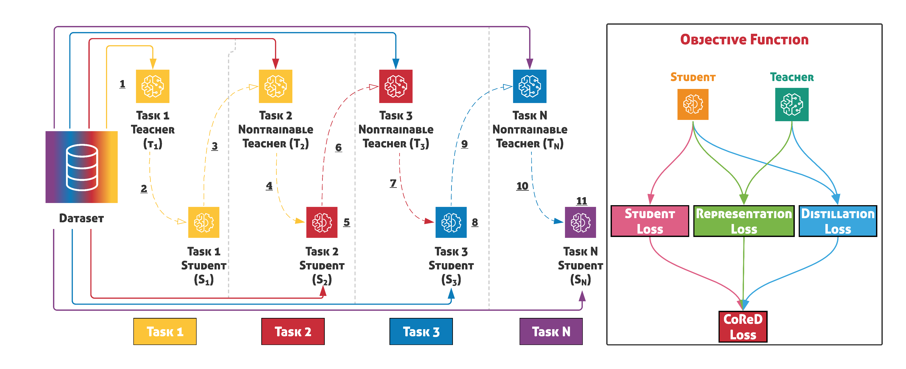
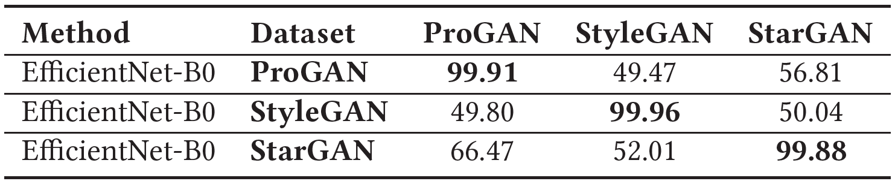
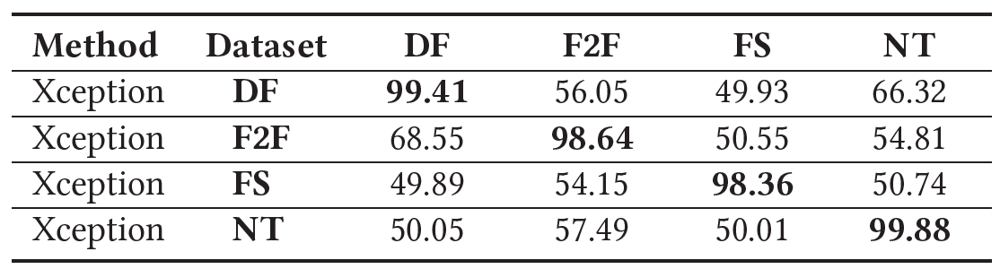
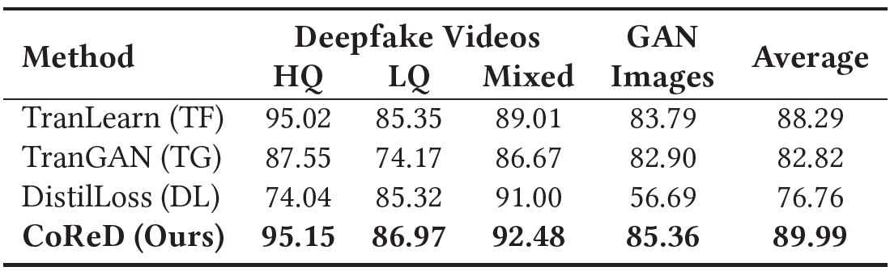
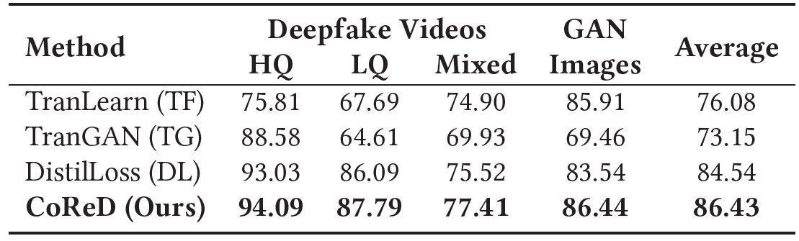
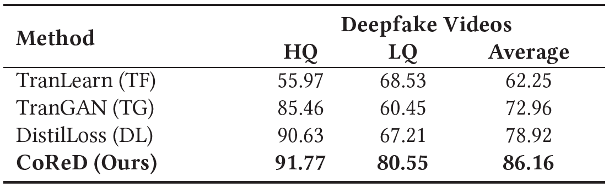

# CoReD: Generalizing Fake Media Detection with Continual Representation using Distillation (ACMMM'21 Oral Paper)
    
**(Accepted for oral presentation at [ACMMM '21](https://2021.acmmm.org/))**

Paper Link: ([arXiv](https://arxiv.org/abs/2107.02408)) (ACMMM version)
<p align="center">

    
<p align="center">



## Overview
We propose _Continual Representation using Distillation_ (_CoReD_) method that employs the concept of **Continual Learning (CL)**, **Representation Learning (RL)**, and **Knowledge Distillation (KD)**.
 
### Comparison Baselines
- Transfer-Learning (_TL_) : The first method is Transfer learning, where we perform fine-tuning on the model to learning the new Task.  
- Distillaion Loss (_DL_) : The third method is a part of our ablation study, wherewe only use the distillation loss component from our CoReD loss function to perform incremental learning.  
- Transferable GAN-generated Images Detection Framewor (_TG_) : The second method is a KD-based GAN image detection framework using L2-SP and self-training.  
    
## Training & Evaluation
   
### - Requirements and Installation
We recommend the installation using the _requilrements.txt_ contained in this Github. 
    
python==3.8.0  
torchvision==0.9.1  
torch==1.8.1  
sklearn  
numpy  
opencv-python  

```console
pip install -r requirements.txt
```
 

####
- **Note that** : 

## - Train & Evaluation
    
### - Full Usages

```console
  -m                   Model name = [CoReD, KD, TG, FT]
  -n                   Network name = [Xception, Efficient']
  -te                  Turn on test mode [True, False]
    
  --name_sources       Name of 'Source' datasets. one or multiple names. (ex. DeepFake / DeepFake_Face2Face / DeepFake_Face2Face_FaceSwap)
  --name_target        Name of 'Target' dataset. only a single name. (ex.DeepFake / Face2Face / FaceSwap / NeuralTextures) / used for Train only')
  --data          Dataset path. it must be contained Sources & Target folder name
  --weigiht     You can select the full path or folder path included in the '.pth' file
    
  -lr                  Learning late (For training)
  -a                   Alpha of KD-Loss
  -nc                  Number of Classes
  -ns                  Number of Stores
  -me                  Number of Epoch (For training)
  -nb                  Batch-Size
  -ng                  GPU-device can be set as ei 0,1,2 for multi-GPU (default=0) 
```
    
####

### - Train
To train and evaluate the model(s) in the paper, run this command:
- **Task1**
   We must train pre-trained single model for task1 .
    ```TRAIN
   python main.py -t={Source Name} -d={folder_path} -w={weights}  
   python main.py -t=DeepFake -d=./mydrive/dataset/' #Example 
    ```
- **Task2 - 4**
    ```TRAIN
   python main.py -s={Source Name} -t={Target Name} -d={folder_path} -w={weights}  
   python main.py -s=Face2Face_DeepFake -t=FaceSwap -d=./mydrive/dataset/ -w=./weights' #Example
    ```
- **Note that** If you set _-s=Face2Face_DeepFake -t=FaceSwap -d=./mydrive/dataset -w=./weights_ when you start training, data path **"./mydrive/dataset"** must include **'Face2Face', 'DeepFake', and 'FaceSwap'**, and these must be contained the **'train','val'** folder which include **'real'&'fake'** folders.

### - Evaluation
After train the model, you can evaluate the dataset.  
- **Eval**    
    ```EVAL
    python main.py -d={dataset as full name} -w={weights} --test  
    python main.py -d=./mydrive/dataset/DeepFake/testset -w=./weights/bestmodel.pth --test #Example
    ```    

## - Result
- **AUC scores (%)** of various methods on compared datasets.
    
#### - Task1 (GAN datasets and FaceForensics++ datasets)
<p align="center">
     
</p>

#### - Task2 - 4
<p align="center">
    
</p>
<p align="center">
    
</p>
<p align="center">
    
</p>


## Citation
If you find our work useful for your research, please consider citing the following papers :)
```
@misc{kim2021cored,
    title={CoReD: Generalizing Fake Media Detection with Continual Representation using Distillation},
    author={Minha Kim and Shahroz Tariq and Simon S. Woo},
    year={2021},
    eprint={2107.02408},
    archivePrefix={arXiv},
    primaryClass={cs.CV}
}
```
 
## - Contect
If you have any questions, please contact us at **kimminha/shahroz@g.skku.edu**


## - License
The code is released under the MIT license.
Copyright (c) 2021


